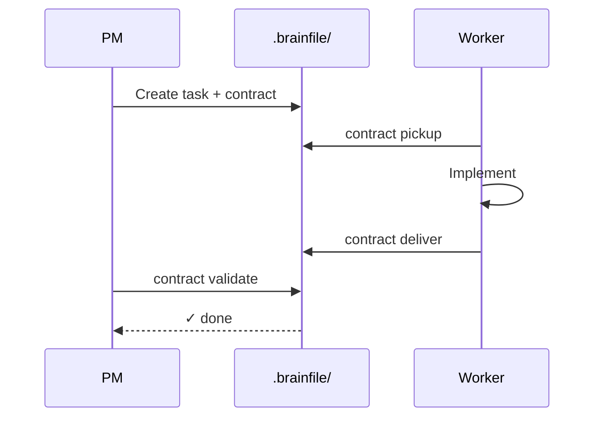
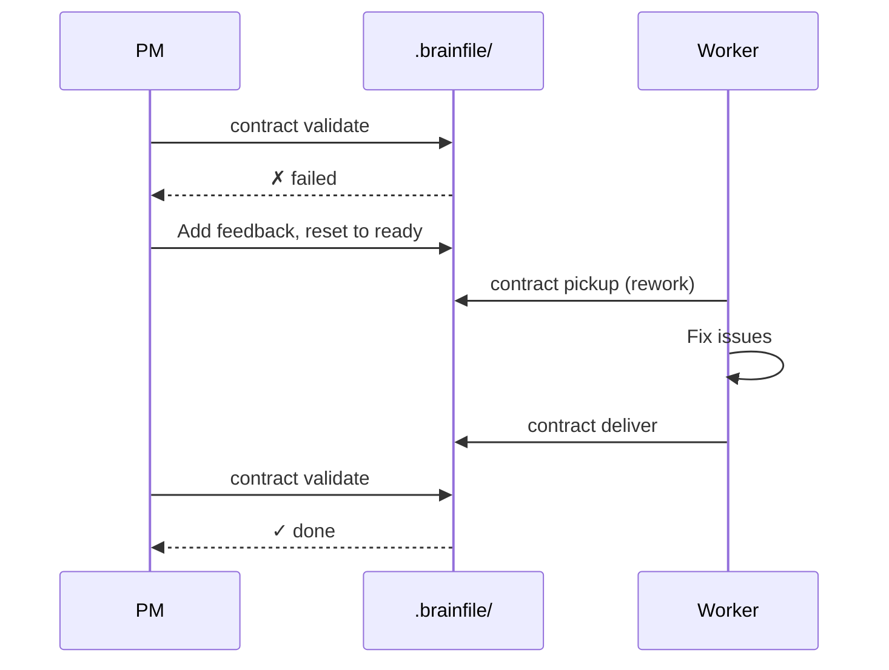

# Agent Workflow Patterns

The contract system enables powerful coordination patterns between different types of agents. This guide outlines the standard roles and workflows for efficient project management.

## Roles

::: info PM Agent (Project Manager)
The PM agent is responsible for the "What" and "Why". They break down high-level goals into actionable tasks, define contracts, and verify results.

- **Primary tools**: `add`, `patch`, `contract attach`, `contract validate`.
- **Key responsibility**: Ensure task descriptions are comprehensive and validation criteria are objective.
:::

::: info Worker Agent (The Doer)
Worker agents (like `codex`, `cursor`, `gemini`) focus on the "How". They pick up contracts, implement code, and deliver artifacts.

- **Primary tools**: `list`, `contract pickup`, `contract deliver`, `show`.
- **Key responsibility**: Meet the deliverables and constraints defined in the contract.
:::

---

## The Standard Loop

A typical feature implementation follows this cycle:



### 1. Planning (PM)
The PM agent analyzes the requirement and creates a task with a contract.

```bash
brainfile add --title "Add OAuth2 Support" \
  --description "Implement Google OAuth2 login flow. See design docs for details." \
  --assignee codex \
  --with-contract \
  --deliverable "file:src/auth/oauth.ts:Implementation" \
  --deliverable "test:src/auth/__tests__/oauth.test.ts:Tests" \
  --validation "npm test -- oauth" \
  --constraint "Use official google-auth-library"
```

### 2. Execution (Worker)
The worker agent detects the assignment and begins work.

```bash
# Worker checks for new tasks
brainfile list --contract ready --assignee codex

# Worker claims the task
brainfile contract pickup -t task-105

# Worker reads full details
brainfile show -t task-105

# Worker implements code...

# Worker self-verifies
npm test -- oauth

# Worker delivers
brainfile contract deliver -t task-105
```

### 3. Verification (PM)
The PM agent reviews the work and completes the task.

```bash
# PM sees delivered tasks
brainfile list --contract delivered

# PM runs automated validation
brainfile contract validate -t task-105

# If all good, PM completes the task (moves to logs/)
brainfile complete -t task-105
```

---

## Handling Rework

If the PM agent finds issues during validation or manual review, the rework flow is triggered.



1.  **Validation Fails**: `brainfile contract validate` fails — status becomes `failed`, feedback is added automatically.
2.  **PM Adds Guidance**: PM edits the task file to add or update `contract.feedback` with specific rework instructions.
3.  **PM Resets Status**: PM edits `contract.status` back to `ready` for rework.
4.  **Worker Re-pickup**: The worker sees the `ready` status, reads the `feedback` field via `brainfile show`, and runs `contract pickup` again.
5.  **Fix & Re-deliver**: Worker fixes the issue and runs `contract deliver`.

---

## Blocked Agents

Sometimes a worker agent cannot proceed due to external factors (missing API keys, ambiguous requirements, upstream bugs).

1.  **Agent Reports Blocked**: The agent edits the task file to set `contract.status` to `blocked` and adds a note to the task log explaining the blocker. (Either the agent or PM can set this status via manual YAML edit; there is no dedicated CLI command for it.)
2.  **PM Notification**: The PM sees the `blocked` status in the TUI or via `brainfile list`.
3.  **Resolution**: The PM provides the missing info or fixes the dependency.
4.  **Reset**: The PM edits `contract.status` back to `ready` or `in_progress`.

---

## Advanced Patterns

### The Multi-Agent Pipeline
Break a large feature into a sequence of contracts:
1.  **Agent A (Architect)**: Produces an interface specification (`docs/api.md`).
2.  **Agent B (Backend)**: Implements the API based on the spec.
3.  **Agent C (Frontend)**: Consumes the API based on the spec.

### Automated Triage
A specialized `triage` agent can monitor incoming bug reports (tasks without contracts), research the cause, and then `attach` a contract with specific `relatedFiles` and `validation` commands for a `codex` agent to fix.

### Self-Referential Tasks
Brainfile can manage its own development. Use contracts to coordinate work on the protocol itself — the same task board that tracks your features can track improvements to the coordination layer.
