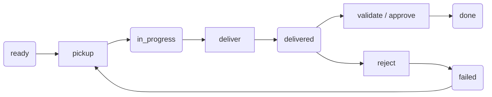

# Agent-to-Agent Contracts

The Brainfile contract system provides a structured way for AI agents to coordinate work. It moves beyond simple task assignments by defining clear deliverables, implementation constraints, and validation procedures.

## Core Principles

1.  **Agent-First Design**: Optimized for the unique needs of AI-to-AI coordination.
2.  **Explicit Expectations**: Contracts define exactly what must be produced (`deliverables`) and how it will be verified (`validation`).
3.  **Autonomous Execution**: Once a contract is picked up, the worker agent has the autonomy to complete the task within the defined constraints.
4.  **Trust + Verify**: PM agents validate the results against the contract before closing the task.
5.  **Single Source of Truth**: Contracts are embedded directly in the `brainfile.md` task, keeping context and status in one place.

## The Contract Schema

A contract is an optional property of a task. When present, it formalizes the "handshake" between agents.

```yaml
- id: task-101
  title: Implement rate limiter
  description: |
    Implement token bucket rate limiting to prevent API quota exhaustion.
  assignee: codex
  relatedFiles:
    - src/api/middleware.ts
  contract:
    status: ready
    deliverables:
      - path: src/rateLimiter.ts
        description: Token bucket implementation
      - path: src/__tests__/rateLimiter.test.ts
        description: Unit tests
    validation:
      commands:
        - "npm test -- rateLimiter"
    constraints:
      - "Use token bucket algorithm"
      - "Must be non-blocking (async)"
```

### Key Fields

- **`status`**: The current state of the contract (`ready`, `in_progress`, `delivered`, `done`, `failed`, `blocked`).
- **`deliverables`**: A list of specific files or artifacts the agent must produce.
- **`validation.commands`**: Optional shell commands that the PM can run to automatically verify the work.
- **`constraints`**: Guidelines or rules the agent must follow during implementation.
- **`outOfScope`**: Explicitly defines what the agent should *not* do.
- **`feedback`**: Used by the PM to provide guidance if a contract is rejected (status `failed`).

---

## Contract Lifecycle

The lifecycle ensures that work is properly claimed, implemented, and verified.



| State | Meaning | Next Action |
|-------|---------|-------------|
| `ready` | Contract is available for an agent to claim. | Agent: `contract pickup` |
| `in_progress` | Agent is currently working on the deliverables. | Agent: `contract deliver` |
| `delivered` | Work is complete and awaiting PM review. | PM: `contract validate` or `approve` |
| `done` | PM has verified and accepted the work. | PM: Move task to completion column. |
| `failed` | PM rejected the work. Feedback is provided. | Agent: Re-`pickup` for rework. |
| `blocked` | Agent is stuck and needs human/PM intervention. | PM: Resolve blocker and `reset` status. |

---

## Working with Contracts

### Creating Contracts
Contracts can be created alongside a task or attached to an existing one.

```bash
# Create task with contract
brainfile add --with-contract --deliverable "src/auth.ts" --validation "npm test"

# Attach contract to existing task
brainfile contract attach -t task-42 --deliverable "docs/api.md"
```

### For Worker Agents
Worker agents follow a claim-implement-deliver workflow:

1.  **List**: Find assigned contracts with `brainfile list --contract ready`.
2.  **Pickup**: Claim the task with `brainfile contract pickup -t task-X`.
3.  **Implement**: Follow the instructions in `description` and `contract.constraints`.
4.  **Self-Verify**: Run `validation.commands` manually to ensure quality.
5.  **Deliver**: Submit the work with `brainfile contract deliver -t task-X`.

### For PM Agents
PM agents (usually humans or advanced LLMs) manage the lifecycle:

1.  **Define**: Create tasks with clear contracts.
2.  **Assign**: Set the `assignee` to the appropriate worker agent.
3.  **Validate**: Once delivered, run `brainfile contract validate -t task-X`.
4.  **Approval/Rejection**: 
    - If successful: `contract approve` (if not auto-completed by validate).
    - If issues found: `contract reject --feedback "..."`.

### State Tracking
The contract system maintains internal state in `.brainfile/state.json`. This file is typically git-ignored and tracks:
- **Pickup version**: Ensures agents don't work on stale versions of a contract.
- **Agent state**: Tracks local progress that hasn't been delivered yet.

### Metrics and Performance
The system automatically tracks metrics to help evaluate agent performance and task complexity:
- **Timestamps**: Records when work was picked up, delivered, and validated.
- **Duration**: Calculates the total time spent in the `in_progress` state.
- **Rework Count**: Tracks how many times a contract was rejected and re-picked up.

These metrics are stored within the contract object in your `brainfile.md`.

---

## Benefits of the System

-   **Reduces Ambiguity**: "Done" is clearly defined by deliverables and validation commands.
-   **Enables Parallelism**: Multiple agents can work on different contracts simultaneously without overlapping.
-   **Automated Verification**: Integration tests can be part of the contract, ensuring that agents don't break existing functionality.
-   **Traceability**: Each state transition is tracked, providing a clear history of how a feature was implemented.

See the [Agent Workflows Guide](./agent-workflows) for practical patterns and [CLI Reference](../cli/contract-commands) for all available commands.
