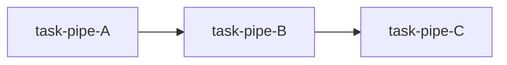
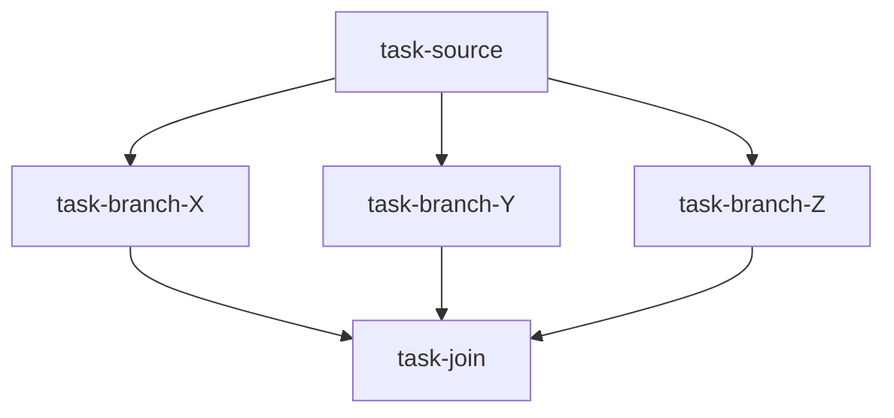

# Orchestration Showcase Plan

This plan defines a concrete path to deliver the orchestration showcase for epic-7, covering:

1. Direct 1:1 dispatch
2. Pipeline DAG orchestration
3. Fan-out/fan-in barrier orchestration

It is designed to be implementation-ready while preserving current compatibility constraints.

---

## Success Criteria (Program Level)

By the end of the showcase:

- Direct tasks can only be claimed by their target worker.
- Pipeline tasks unlock only when dependencies are satisfied.
- Fan-in tasks wait at a barrier until required branch tasks are satisfied.
- Parallel tasks with conflicting write-intent do not run concurrently.
- PM authority boundaries are enforced for terminal decisions.
- Audit logs provide replayable evidence of scheduler decisions.

---

## Scope and Non-Goals

### In scope
- Schema additions for orchestration metadata (task-level optional fields)
- Event contract for realtime + audit mapping
- Scheduler and dependency/join behavior in Pi extension
- Demo scenarios and acceptance harness/checklist

### Out of scope
- Cross-machine transport
- Breaking schema changes requiring mandatory migration
- New external services or infrastructure dependencies

---

## Phased Delivery Plan

## Phase 1 — Spec Baseline

**Goal:** lock schema and event contract semantics before transport/scheduler implementation.

**Deliverables:**
- `protocol/docs/specs/orchestration-schema.md`
- `protocol/docs/specs/orchestration-events.md`
- this plan document

**Exit criteria:**
- dispatch, dependency, join, resource, authority semantics are unambiguous
- reason-code taxonomy is fixed
- compatibility contract is explicit

---

## Phase 2 — Transport Layer (Realtime bus + audit sink)

**Goal:** introduce local realtime signal path while preserving JSONL audit/replay.

**Expected implementation artifacts:**
- `protocol/example/integrations/pi/brainfile-extension/bus.ts`
- event append/replay boundary updates

**Exit criteria:**
- realtime bus notifications function locally
- JSONL remains append-only source of audit truth
- replay from audit log remains functional

---

## Phase 3 — Scheduler Core (Direct dispatch + lease/claim)

**Goal:** PM-authoritative claim arbitration and direct-target enforcement.

**Expected implementation artifacts:**
- scheduler module with claim lease model
- listener + contract pickup integration

**Exit criteria:**
- direct-target mismatch claims are rejected with explicit reason code
- successful claims issue lease metadata and produce auditable decision trail
- pool behavior remains unchanged for non-direct tasks

---

## Phase 4 — Workflow Operators (dependsOn + barrier join)

**Goal:** implement DAG gating and fan-in barrier logic.

**Expected implementation artifacts:**
- dependency readiness evaluator
- join/barrier evaluator
- projection updates for dependency/join state

**Exit criteria:**
- downstream tasks are not delegated until dependencies satisfy policy
- barrier tasks wait until required branches satisfy policy
- dependency/join wait states produce auditable reason codes

---

## Phase 5 — Showcase and Acceptance Harness

**Goal:** provide reproducible demos with expected event/audit outputs.

**Expected implementation artifacts:**
- showcase runbook (`/example/integrations/pi/brainfile-extension/SHOWCASE.md`)
- acceptance checklist (`/guides/orchestration-acceptance`)
- scenario definitions (`/example/integrations/pi/brainfile-extension/examples/showcase-scenarios.md`)

**Exit criteria:**
- all three workflow families pass acceptance checks
- expected event sequences are documented and reproducible

---

## Scenario Definitions and Acceptance

## Scenario A: Direct 1:1 Dispatch

### Setup
- Task `task-direct-1`
- `dispatch.mode=direct`, `dispatch.target=worker-2`

### Expected behavior
1. `worker-1` claim -> rejected (`dispatch_target_mismatch`)
2. `worker-2` claim -> accepted
3. task reaches delivered and PM validates terminal result

### Required evidence
- audit row showing rejection reason
- audit row showing accepted claim and pickup
- terminal validation and completion trace

---

## Scenario B: Pipeline DAG

### Graph

### Expected behavior
- B is not schedulable before A satisfies policy
- C is not schedulable before B satisfies policy
- unlock order is deterministic and auditable

### Required evidence
- scheduler waiting reasons (`dependency_unmet`)
- delegation events in dependency order

---

## Scenario C: Fan-out / Fan-in Barrier

### Graph

### Expected behavior
- join task remains waiting until barrier policy is satisfied
- partial branch completion does not trigger early join delegation
- if one branch fails and policy is all_success, join stays blocked

### Required evidence
- `join_waiting` reason while incomplete
- join delegation only after policy passes
- blocked reason when branch failure violates policy

---

## Resource-Touch Safety Acceptance

### Setup
- Two tasks both declare exclusive write to same path

### Expected behavior
- second task is blocked/rejected by configured conflict policy
- no concurrent in-progress overlap on same exclusive writer path

### Required evidence
- `resource_conflict` reason code
- scheduler decision trace for release/unblock when conflict clears

---

## Authority Boundary Acceptance

The following must be enforceable:

- Worker cannot finalize `delivered -> done` directly.
- Worker cannot emit PM-only scheduler transitions.
- PM-only transitions are auditable with actor identity.

**Required evidence:**
- authority rejection event with `authority_violation` reason code
- no illegal status transition applied

---

## Backward Compatibility Acceptance

- Tasks with no orchestration fields continue current behavior.
- Existing envelope rows (pre-orchestration metadata) parse unchanged.
- Existing listener/CLI workflows continue for non-showcase tasks.

---

## Risks and Mitigations

| Risk | Impact | Mitigation |
|---|---|---|
| Ambiguous dependency semantics | Incorrect scheduling | Single canonical readiness policy definitions in schema/event specs |
| Claim races under contention | Duplicate pickups | Lease + existing pickup CAS lock integration |
| Event spam/noisy PM UX | Reduced operator trust | batched notifications and reason-coded blocked summaries |
| Resource conflict false positives | Throughput loss | strict path normalization + deterministic overlap rules |

---

## Operational Checklist

Before declaring showcase complete:

- [ ] Direct scenario passes (including non-target rejection)
- [ ] Pipeline scenario passes (ordered unlock)
- [ ] Fan-in scenario passes (barrier behavior)
- [ ] Resource conflict scenario passes
- [ ] Authority boundary checks pass
- [ ] Replay from audit log reconstructs run outcomes
- [ ] Documentation includes expected event traces per scenario
