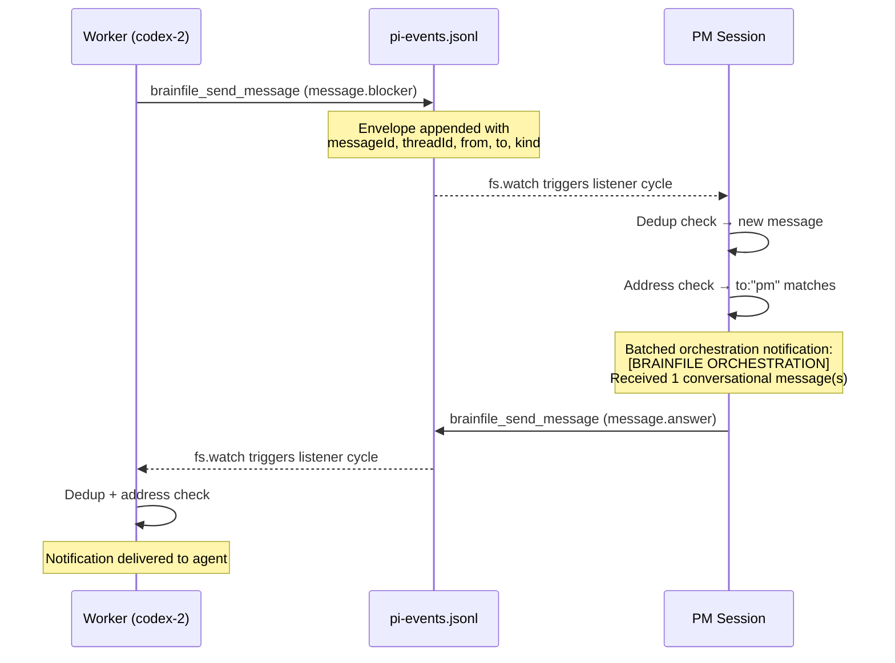

<!-- Validation compatibility: Pi|pi extension|run.closed|stale|worker -->

# Pi Extension <Badge type="warning" text="beta" />

The Brainfile extension for [Pi](https://pi.dev/) is the primary way to run multi-agent orchestration against a Brainfile board.

[Source code on GitHub](https://github.com/brainfile/protocol/tree/main/example/integrations/pi/brainfile-extension)

## Features

### PM and Worker Roles

Every Pi session runs as either a **PM** (project manager) or a **Worker**:

| Role | Listener default | Responsibility |
|------|-----------------|---------------|
| PM | Off | Creates contracts, delegates work, validates deliveries |
| Worker | On | Picks up assigned contracts, implements, delivers |

Set the role with `/listen role <pm|worker|auto>`. In `auto` mode the extension checks for an existing open PM run on startup — if one exists, the session demotes itself to worker to avoid conflicts. The same check runs on model switch.

### Event-Sourced Coordination

All orchestration state is recorded as an append-only event log at `.brainfile/state/pi-events.jsonl`. Each PM run gets a unique `runId`, and events are scoped to that run.

| Category | Events |
|----------|--------|
| Run lifecycle | `run.started`, `run.blocked`, `run.closed` |
| Contracts | `contract.delegated`, `contract.picked_up`, `contract.delivered`, `contract.validated` |
| Tasks | `task.stale`, `task.completed` |
| Workers | `worker.online`, `worker.heartbeat`, `worker.offline` |

`worker.offline` is best-effort — it fires on shutdown, listener disable, or role switch, but a crashed session won't emit it. The heartbeat TTL handles that case.

### Run Lifecycle

1. PM enables listener → `run.started` is emitted.
2. PM creates contracts and assigns workers → `contract.delegated` for each.
3. Workers claim and complete contracts → `contract.picked_up`, `contract.delivered`, `contract.validated`.
4. The PM tracks all delegated tasks by `runId`.
5. The run ends with `run.closed`, which includes:
   - `result` — `success`, `blocked`, etc.
   - `counts` — how many tasks were delegated, completed, failed
   - `openTasks` — any unresolved tasks (required when result is not `success`)

### PM Notifications

During multi-agent runs the PM chat stays quiet. The PM is only interrupted for:

- **Deliveries ready** — all open tasks in the run have been delivered and are awaiting validation
- **Blocked** — a worker hit an external dependency (`run.blocked`)
- **Run complete** — all delegated work is validated and finished (`run.closed`)

Routine progress is visible via `/listen status`.

### Stale Task Detection

If an `in_progress` contract shows no activity for too long, the extension flags it as stale:

1. `task.stale` is emitted for each affected task.
2. `run.blocked` is emitted with the reason and counts.
3. If the run cannot continue, `run.closed` is emitted with remaining `openTasks`.

The default timeout is **1 hour**. Override per workspace in `.pi/settings.json`:

```json
{
  "brainfileExtension": {
    "staleTimeoutSeconds": 1800
  }
}
```

### Worker Presence and Identity

Workers are auto-assigned numbered identities based on their model family — `claude-1`, `codex-2`, `gemini-1`, etc. Slot assignment uses filesystem lease locks under `.brainfile/state/worker-claims/` so that multiple workers starting at the same time never collide on the same identity.

Presence is tracked via periodic heartbeats:

| Event | When |
|-------|------|
| `worker.online` | First heartbeat after listener starts |
| `worker.heartbeat` | Every 20 seconds while active |
| `worker.offline` | Listener stops, role changes, or session exits |

A worker is considered unavailable if no heartbeat arrives within the 45-second TTL. From the PM session, `/listen status` shows the current run ID, online workers, and stale timeout.

**Assignee matching:** Numbered identities match exactly — `codex-1` only picks up tasks assigned to `codex-1`. Bare family names like `codex` act as wildcards for backward compatibility.

### Delivery Verification

`/bf contract deliver` checks that all declared deliverable files exist before accepting. It also records evidence in contract metrics: git HEAD, file sizes, and validation output.

## Commands

### Listener

| Command | Description |
|---------|-------------|
| `/listen` | Toggle listener on/off |
| `/listen on` | Start the background listener |
| `/listen off` | Stop the listener |
| `/listen status` | Show run state, active workers, stale timeout |
| `/listen now` | Run one poll cycle immediately |
| `/listen role <pm\|worker\|auto>` | Set session role |
| `/listen assignee <name>` | Override worker identity |
| `/listen auto` | Reset to auto-assigned identity |
| `/listen mode <start\|wait>` | Start working immediately or wait for assignment |

Role aliases: `main`, `planner`, `orchestrator` → pm; `agent` → worker.

### Board

| Command | Description |
|---------|-------------|
| `/bf pick` | Interactively select an active task |
| `/bf <task-id>` | Set active task directly (shortcut) |
| `/bf status` | Show current task and contract state |
| `/bf board` | Print the board summary |
| `/bf clear` | Clear the active task |
| `/bf move <id> <column>` | Move a task to a column |
| `/bf contract pickup <id>` | Claim a specific contract |
| `/bf contract deliver <id>` | Mark a contract as delivered |
| `/bf contract validate <id>` | Validate deliverables and run checks |
| `/bf plan` | Toggle plan mode (mutations disabled) |

### Top-Level

| Command | Description |
|---------|-------------|
| `/plan` | Toggle plan mode (mutations disabled) |

## Setup

1. Clone the extension into your workspace:

```bash
git clone https://github.com/brainfile/protocol.git /tmp/brainfile-protocol
cp -r /tmp/brainfile-protocol/example/integrations/pi/brainfile-extension/ .pi/extensions/brainfile-extension/
```

2. Install dependencies:

```bash
cd .pi/extensions/brainfile-extension && npm install
```

3. In Pi, run `/reload` to activate.

## Typical Workflow

1. **PM session** — `/listen role pm` → `/listen on`
2. **Worker sessions** — `/listen role worker` → `/listen on`
3. PM creates tasks with contracts and assigns them to workers
4. Workers automatically pick up `ready` contracts matching their identity
5. Workers implement deliverables and run `/bf contract deliver`
6. PM receives a notification when work is blocked or the run is complete, then validates

## Backward Compatibility

Existing `/listen`, `/bf`, and `brainfile_*` tool workflows continue to work unchanged.

---

## A2A Messaging <Badge type="warning" text="Beta" />

The A2A (Agent-to-Agent) messaging protocol extends the event-sourced coordination layer with structured conversational messaging, near-realtime event detection, message deduplication, and worker load awareness. These features are **beta** and may evolve in future releases.

### Envelope-Based Messaging

All events now use a unified **Envelope** format that is a backward-compatible superset of the original `PiEventRecord`. Existing JSONL rows remain valid without migration.

An Envelope adds these fields on top of the base event record:

| Field | Type | Description |
|-------|------|-------------|
| `messageId` | `string` | Unique message identifier (defaults to event `id`) |
| `threadId` | `string` | Groups related messages (defaults to `task:<taskId>` or `runId`) |
| `inReplyTo` | `string?` | `messageId` of the message being replied to |
| `from` | `string?` | Sender identity (e.g. `pm`, `codex-2`) |
| `to` | `string?` | Recipient identity (e.g. `pm`, `codex-1`) |
| `kind` | `EnvelopeKind` | Event or message type |
| `requiresAck` | `boolean?` | Whether the recipient should auto-acknowledge |
| `priority` | `string?` | `low`, `normal`, `high`, or `urgent` |
| `expiresAt` | `string?` | ISO timestamp after which the message is stale |

**EnvelopeKind** includes all existing `PiEventType` values plus conversational message kinds:

| Kind | Purpose |
|------|---------|
| `message.question` | Ask a question to another agent |
| `message.answer` | Reply to a question |
| `message.ack` | Acknowledge receipt of a message |
| `message.status` | Report status or progress |
| `message.blocker` | Signal a blocking issue |
| `message.decision` | Communicate an architectural or process decision |

### Near-Realtime Event Detection

The listener uses `fs.watch` on `pi-events.jsonl` as the **primary trigger** for processing new events. This replaces the previous 10-second polling interval as the main detection mechanism.

- **`fs.watch`** fires on file change, triggering a listener cycle immediately
- **30-second `setInterval`** is retained as a safety-net fallback for environments where `fs.watch` is unreliable (NFS, WSL1, etc.)
- **Byte-offset tailing** replaces the old line-count cursor — the extension tracks `lastByteOffset` in the event projection and reads only new bytes appended since the last cycle, correctly handling coalesced writes

On platforms where `fs.watch` is not available or throws, the extension degrades gracefully to interval-only polling.

### Message Deduplication

Each listener session maintains an **ephemeral in-memory dedup set** (`seenMessageIds`) to prevent duplicate processing of the same envelope:

| Parameter | Value |
|-----------|-------|
| Max tracked IDs | 1,000 |
| TTL per entry | 5 minutes |
| Persistence | None — per session only |

When a message is seen, its `messageId` is recorded with a timestamp. On subsequent encounters within the TTL window, the message is silently skipped. The set is pruned on every cycle to stay within the size cap.

### Conversational Messages

Agents can exchange structured messages using the `brainfile_send_message` tool. Messages are written to the shared `pi-events.jsonl` event log and processed by recipient sessions during their next listener cycle.

#### Message Flow



#### Tool: `brainfile_send_message`

| Parameter | Required | Description |
|-----------|----------|-------------|
| `to` | ✅ | Recipient (e.g. `pm`, `codex-2`, `worker`) |
| `taskId` | ✅ | Related task ID |
| `kind` | ✅ | One of: `message.question`, `message.answer`, `message.ack`, `message.status`, `message.blocker`, `message.decision` |
| `body` | ✅ | Message body text |
| `threadId` | ❌ | Thread ID for grouping (defaults to `task:<taskId>`) |
| `inReplyTo` | ❌ | `messageId` of the message being replied to |
| `requiresAck` | ❌ | If `true`, recipient auto-sends a `message.ack` |

**Example — Worker reports a blocker:**

```json
{
  "to": "pm",
  "taskId": "task-42",
  "kind": "message.blocker",
  "body": "Cannot proceed: API key for staging environment is expired.",
  "threadId": "task:task-42"
}
```

**Example — PM answers a question:**

```json
{
  "to": "codex-2",
  "taskId": "task-42",
  "kind": "message.answer",
  "body": "Use the test API key from .env.test for now.",
  "inReplyTo": "1740000000000-abc123",
  "threadId": "task:task-42"
}
```

#### Delivery and Batching

- Messages addressed to a session are **batched per listener cycle** and delivered as a single `[BRAINFILE ORCHESTRATION]` notification
- `message.ack` messages are **not batched** — they are only sent, never surfaced as notifications
- Messages with `requiresAck: true` trigger an automatic `message.ack` reply from the recipient
- Address matching uses the same wildcard rules as task assignment: `pm` targets PM sessions, bare names like `codex` match any `codex-*` worker, numbered names like `codex-2` require an exact match

#### Thread Tracking

Use `threadId` and `inReplyTo` to maintain coherent conversation threads:

- `threadId` defaults to `task:<taskId>` — all messages about a task share the same thread
- `inReplyTo` links a reply to the specific `messageId` it responds to
- Recipients see thread context in the orchestration notification

### Worker Load Awareness

Workers now emit `worker.ready` events alongside `worker.online` and `worker.heartbeat`, reporting their current load:

| Field | Type | Description |
|-------|------|-------------|
| `maxConcurrency` | `number` | Maximum tasks this worker can handle (typically `1`) |
| `activeCount` | `number` | Tasks currently `in_progress` for this worker |
| `idle` | `boolean` | `true` when `activeCount < maxConcurrency` |

The PM `/listen status` output now shows worker load details:

```
Available workers: codex-1 (0/1, idle, 5s), codex-2 (1/1, at-max, 12s)
```

**Backward compatibility:** Workers that only emit `worker.online`/`worker.heartbeat` (without `worker.ready`) continue to work. The PM infers load by counting `in_progress` tasks on the board and defaults `maxConcurrency` to `1`.

| Event | Workers |
|-------|---------|
| `worker.online` | First heartbeat — presence only |
| `worker.heartbeat` | Periodic — presence only |
| `worker.ready` | Emitted alongside online/heartbeat — includes load data |
| `worker.offline` | Best-effort teardown |

## See Also

- [Orchestration Guide](/guides/orchestration) — General orchestration patterns
- [AI Agent Integration](/agents/integration) — MCP, hooks, and manual setup
- [MCP Server](/tools/mcp) — Tool-based integration for other agents
