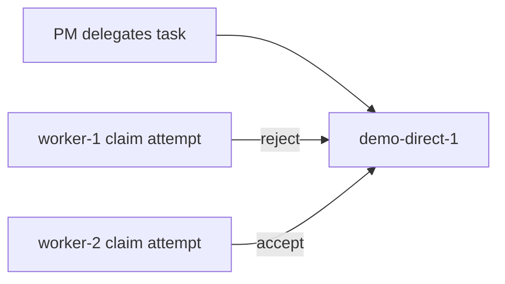
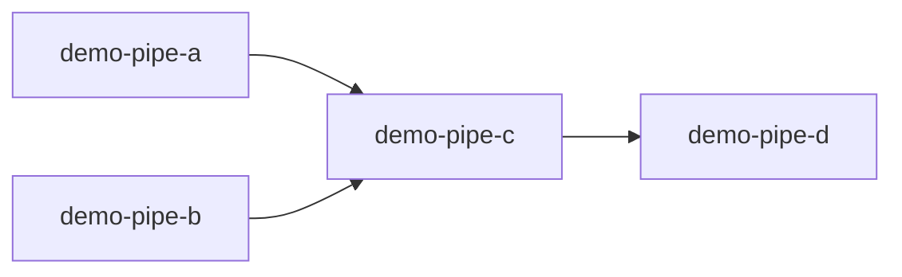
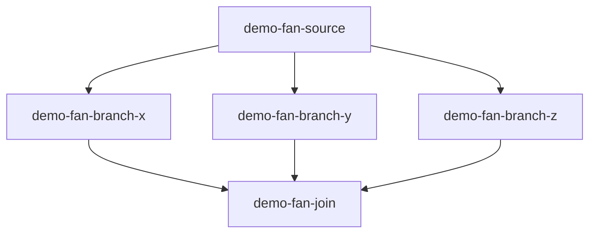

# Orchestration Showcase Scenario Definitions

This file contains concrete task-graph definitions for the epic-7 Phase 5 showcase.

Use these scenarios with:
- `../SHOWCASE.md` (operator runbook)
- `protocol/docs/guides/orchestration-acceptance.md` (acceptance checklist/harness)

> These examples use the orchestration fields defined in:
> `protocol/docs/specs/orchestration-schema.md`

---

## Conventions

- IDs are prefixed with `demo-` so they are easy to find/filter.
- Deliverables intentionally point at an existing file (`.brainfile/brainfile.md`) to keep demos lightweight.
- `scheduler.authority: pm` is included to make PM authority explicit in traces.
- Expected reason codes use the canonical taxonomy from `orchestration-events.md`.

---

## Scenario A — Direct 1:1 Dispatch Exclusion

### Graph



### Task definition

```yaml
---
id: demo-direct-1
type: task
title: Demo - direct 1:1 dispatch (worker-2 only)
column: todo
assignee: worker-2
tags: [demo, orchestration, direct]
contract:
  status: ready
  version: 1
  deliverables:
    - type: file
      path: .brainfile/brainfile.md
      description: Existing file for lightweight demo delivery
orchestration:
  dispatch:
    mode: direct
    target: worker-2
  scheduler:
    authority: pm
---
```

### Expected audit/event outputs

| Check | Expected evidence |
|---|---|
| Non-target claim rejection | `kind=message.decision`, `data.orchestration.decision=rejected`, `reasonCode=dispatch_target_mismatch`, `to=worker-1` |
| Target claim acceptance | `kind=contract.picked_up`, `from=worker-2`, `data.orchestration.decision=accepted` |
| Standard completion path | `contract.delivered` followed by PM `contract.validated` |

---

## Scenario B — Pipeline DAG with Parallel Prerequisites

### Graph



### Task definitions

#### `demo-pipe-a` (parallel prerequisite A)

```yaml
---
id: demo-pipe-a
type: task
title: Demo pipeline A
column: todo
assignee: worker-1
tags: [demo, orchestration, pipeline]
contract:
  status: ready
  version: 1
  deliverables:
    - type: file
      path: .brainfile/brainfile.md
orchestration:
  dispatch:
    mode: direct
    target: worker-1
  scheduler:
    authority: pm
---
```

#### `demo-pipe-b` (parallel prerequisite B)

```yaml
---
id: demo-pipe-b
type: task
title: Demo pipeline B
column: todo
assignee: worker-2
tags: [demo, orchestration, pipeline]
contract:
  status: ready
  version: 1
  deliverables:
    - type: file
      path: .brainfile/brainfile.md
orchestration:
  dispatch:
    mode: direct
    target: worker-2
  scheduler:
    authority: pm
---
```

#### `demo-pipe-c` (fan-in stage from parallel prerequisites)

```yaml
---
id: demo-pipe-c
type: task
title: Demo pipeline C (unlocked by A and B)
column: todo
assignee: pool
tags: [demo, orchestration, pipeline]
contract:
  status: ready
  version: 1
  deliverables:
    - type: file
      path: .brainfile/brainfile.md
orchestration:
  dispatch:
    mode: pool
  dependsOn: [demo-pipe-a, demo-pipe-b]
  readiness:
    successState: done
    onDependencyFailure: blocked
  scheduler:
    authority: pm
---
```

#### `demo-pipe-d` (downstream stage)

```yaml
---
id: demo-pipe-d
type: task
title: Demo pipeline D (after C)
column: todo
assignee: pool
tags: [demo, orchestration, pipeline]
contract:
  status: ready
  version: 1
  deliverables:
    - type: file
      path: .brainfile/brainfile.md
orchestration:
  dispatch:
    mode: pool
  dependsOn: [demo-pipe-c]
  readiness:
    successState: done
  scheduler:
    authority: pm
---
```

### Expected audit/event outputs

| Check | Expected evidence |
|---|---|
| C blocked before both prereqs done | waiting event with `reasonCode=dependency_unmet` for `demo-pipe-c` |
| C unlocks only after A+B terminal success | `contract.delegated` for `demo-pipe-c` appears only after both prerequisites done |
| D waits for C | `reasonCode=dependency_unmet` on D until C is done |

---

## Scenario C — Fan-Out / Fan-In Barrier (PM Synthesis)

### Graph



### Task definitions

#### `demo-fan-source`

```yaml
---
id: demo-fan-source
type: task
title: Demo fan source task
column: todo
assignee: worker-1
tags: [demo, orchestration, fanout]
contract:
  status: ready
  version: 1
  deliverables:
    - type: file
      path: .brainfile/brainfile.md
orchestration:
  dispatch:
    mode: direct
    target: worker-1
  scheduler:
    authority: pm
---
```

#### `demo-fan-branch-x` / `demo-fan-branch-y` / `demo-fan-branch-z`

```yaml
---
id: demo-fan-branch-x
type: task
title: Demo fan branch X
column: todo
assignee: pool
tags: [demo, orchestration, fanout]
contract:
  status: ready
  version: 1
  deliverables:
    - type: file
      path: .brainfile/brainfile.md
orchestration:
  dispatch:
    mode: pool
  dependsOn: [demo-fan-source]
  readiness:
    successState: done
  scheduler:
    authority: pm
---
```

> Duplicate the same structure for `demo-fan-branch-y` and `demo-fan-branch-z` with matching IDs.

#### `demo-fan-join` (PM synthesis barrier)

```yaml
---
id: demo-fan-join
type: task
title: Demo fan-in join (PM synthesis)
column: todo
assignee: pm
tags: [demo, orchestration, fanin, barrier]
contract:
  status: ready
  version: 1
  deliverables:
    - type: docs
      path: protocol/example/integrations/pi/brainfile-extension/SHOWCASE.md
      description: Placeholder PM synthesis artifact for demo
orchestration:
  join:
    mode: barrier
    requires: [demo-fan-branch-x, demo-fan-branch-y, demo-fan-branch-z]
    policy: all_success
  scheduler:
    authority: pm
---
```

### Expected audit/event outputs

| Check | Expected evidence |
|---|---|
| Join waits while any branch incomplete | waiting signal includes `reasonCode=join_waiting` for `demo-fan-join` |
| No early PM synthesis | no `contract.delegated` for `demo-fan-join` until all required branches done |
| Barrier opens after all branches succeed | `contract.delegated` for join appears once X+Y+Z are terminal success |
| Failure guard (negative test) | if one branch fails under `all_success`, join remains blocked with `dependency_failed` |

---

## Suggested IDs and Filters

Use these filters during demos:

- `rg "demo-direct-1" .brainfile/state/pi-events.jsonl`
- `rg "demo-pipe-" .brainfile/state/pi-events.jsonl`
- `rg "demo-fan-" .brainfile/state/pi-events.jsonl`
- `rg "dispatch_target_mismatch|dependency_unmet|join_waiting" .brainfile/state/pi-events.jsonl`
